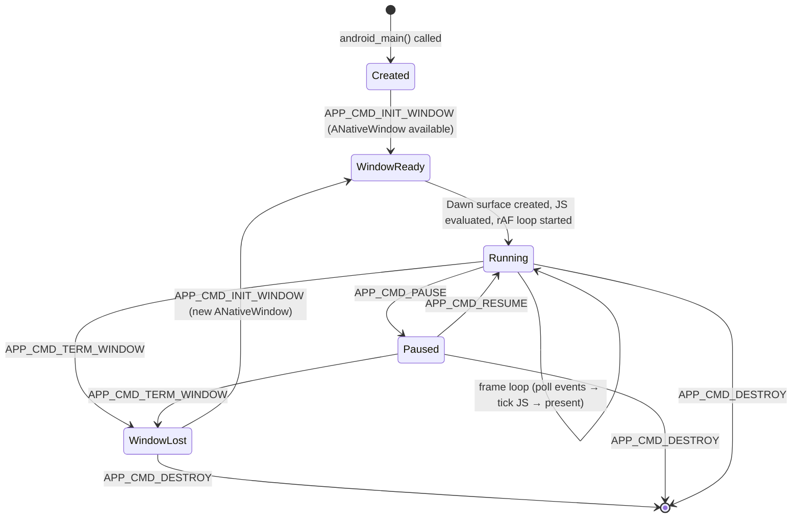
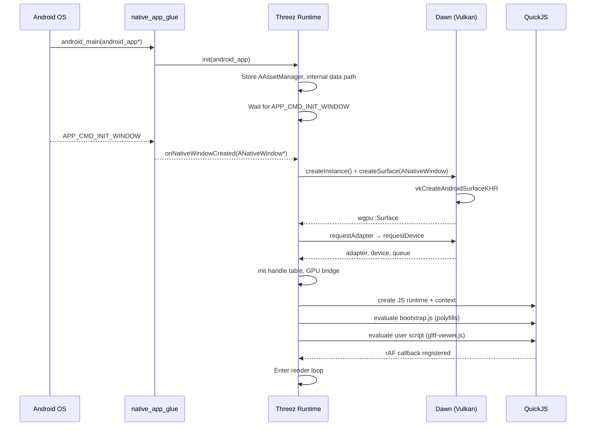
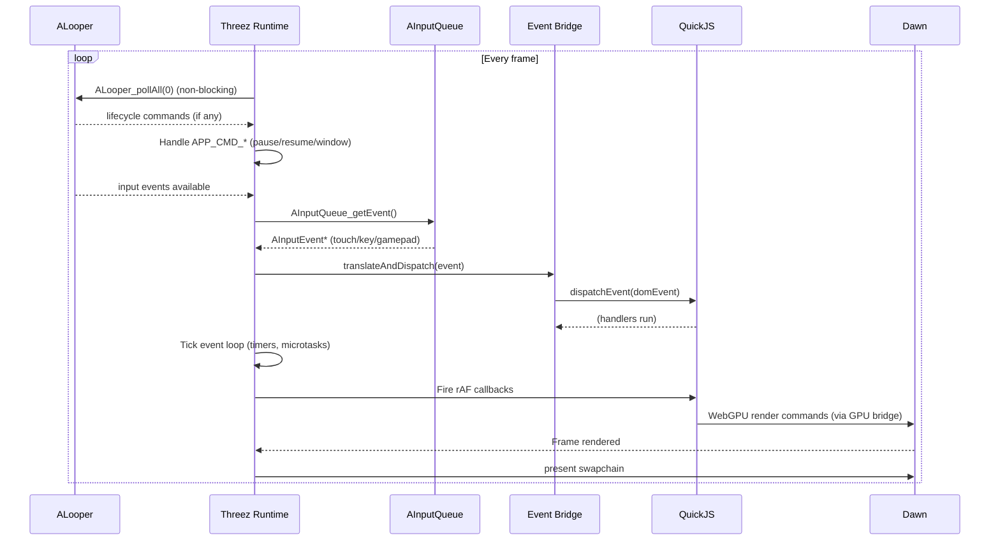
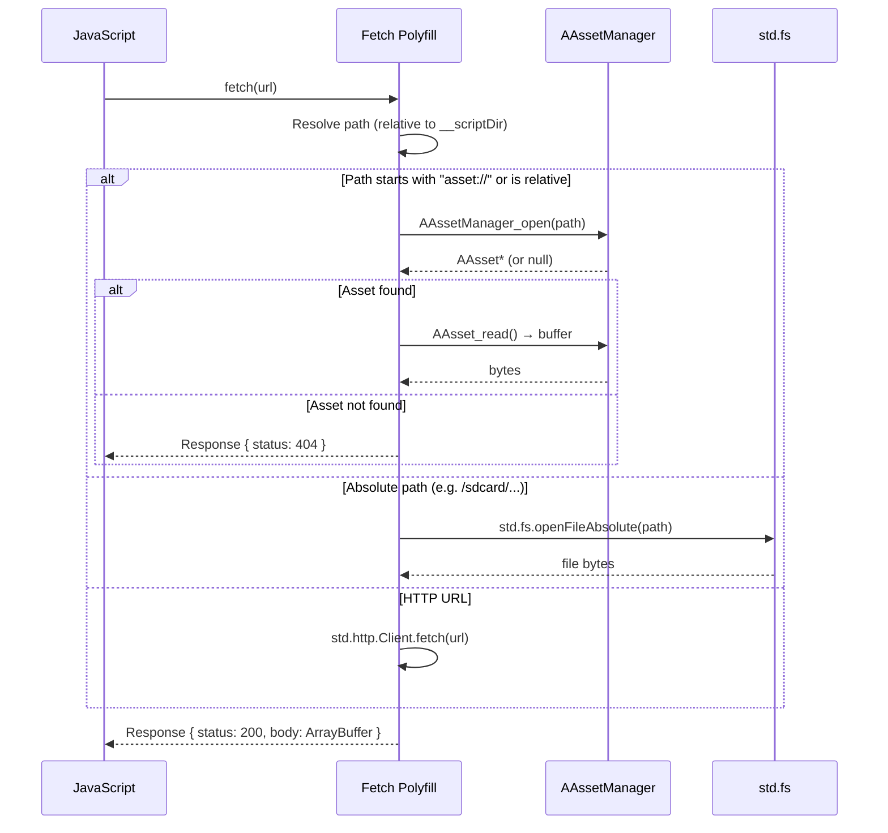
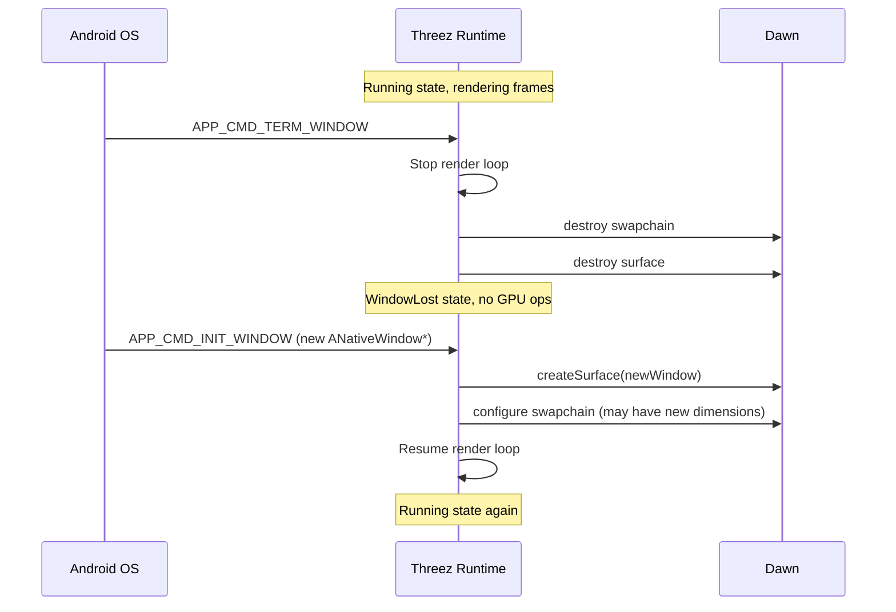

<!-- status: locked -->
<!-- epic-slug: android-port -->
# Core Flows: Android Port

## Flow 1: App Lifecycle State Machine

**Actors**: Android OS, NativeActivity, Threez Runtime
**Trigger**: User launches the app / OS lifecycle events
**Invariant**: GPU resources are only used when ANativeWindow is valid



**Key constraints**:
- Between `TERM_WINDOW` and a new `INIT_WINDOW`, no GPU operations may occur. Dawn surface + swapchain must be destroyed.
- Between `PAUSE` and `RESUME`, the entire JS event loop freezes — no rAF, no timers, no microtasks. Saves battery and avoids GPU errors from background execution.
- `APP_CMD_DESTROY` triggers full cleanup: JS engine, GPU bridge, handle table, event loop.

**Desktop comparison**: Desktop has none of this — the window exists for the entire process lifetime. On Android, the window can be destroyed and recreated (e.g., screen rotation, task switcher).

## Flow 2: Startup Sequence

**Actors**: Android OS, NativeActivity glue, Threez Runtime, Dawn, QuickJS



**Key difference from desktop**: On desktop, GLFW window creation and Dawn surface creation happen synchronously in `runScript()`. On Android, we must wait for `APP_CMD_INIT_WINDOW` before creating the Dawn surface. The JS engine can be initialized earlier, but the GPU bridge can't be connected until the window exists.

## Flow 3: Render Loop (per frame)

**Actors**: Threez Runtime, ALooper, AInputQueue, QuickJS, Dawn
**Trigger**: Continuous while in Running state
**Invariant**: One present per frame, no GPU ops if window is lost



**Desktop comparison**: Desktop uses `glfwPollEvents()` instead of `ALooper_pollAll()`, and GLFW callbacks instead of `AInputQueue`. The rest (tick event loop, fire rAF, present) is identical.

## Flow 4: Input Event Translation

**Actors**: AInputQueue, Event Bridge, QuickJS
**Trigger**: User touches screen, presses gamepad button, uses stylus

### Touch → PointerEvent

```
AInputEvent (AMOTION_EVENT_ACTION_DOWN/MOVE/UP)
  ├── getX(), getY()              → clientX, clientY
  ├── getPointerId()              → pointerId
  ├── getPressure()               → pressure
  ├── getToolType()               → pointerType ("touch" | "pen")
  ├── getActionMasked()           → type ("pointerdown" | "pointermove" | "pointerup")
  └── getPointerCount()           → (multi-touch: dispatch per pointer)
```

**Multi-touch for OrbitControls**:
- 1 finger drag → `pointermove` → OrbitControls rotate
- 2 finger pinch → two `pointermove` events → OrbitControls zoom (distance change)
- 2 finger drag → two `pointermove` events → OrbitControls pan (centroid movement)

### Gamepad → GamepadEvent + KeyboardEvent

```
AInputEvent (AINPUT_SOURCE_GAMEPAD)
  ├── Axis events (AMOTION_EVENT_AXIS_*)  → Gamepad API axes
  ├── Button events (AKEY_EVENT_ACTION_*)  → Gamepad API buttons
  └── Mapped to navigator.getGamepads() polling model
```

### Stylus → PointerEvent (with extras)

```
AInputEvent (AMOTION_EVENT_TOOL_TYPE_STYLUS)
  ├── All touch fields above
  ├── getPressure()       → pressure (0.0–1.0, higher precision than finger)
  ├── getTiltX/Y()        → tiltX, tiltY
  └── pointerType = "pen"
```

## Flow 5: Asset Loading

**Actors**: JavaScript (fetch/GLTFLoader), Fetch Polyfill, AAssetManager / std.fs
**Trigger**: `fetch("DamagedHelmet.glb")` or `fetch("/sdcard/models/scene.glb")`



**Key design choice**: Relative paths default to AAssetManager (APK-bundled). Absolute paths use filesystem. HTTP URLs use the network. This lets the same JS code (`fetch("DamagedHelmet.glb")`) work on both desktop (filesystem) and Android (APK assets) without changes.

## Flow 6: GPU Surface Lifecycle (Window Recreate)

**Actors**: Android OS, Threez Runtime, Dawn
**Trigger**: Screen rotation, task switcher return, split-screen toggle



**Critical detail**: The handle table and JS-side GPU objects (device, queue, pipeline, etc.) survive the window recreate. Only the surface and swapchain are destroyed/recreated. This means the JS application doesn't need to know about window recreation — it just sees a resize event.
