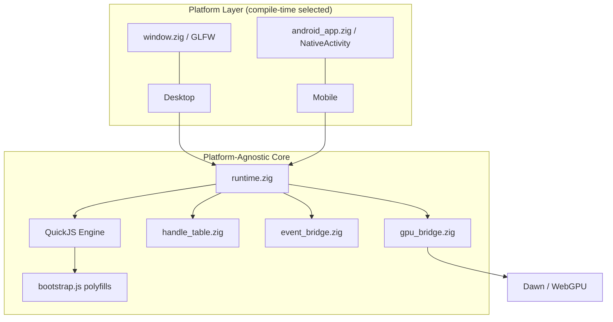
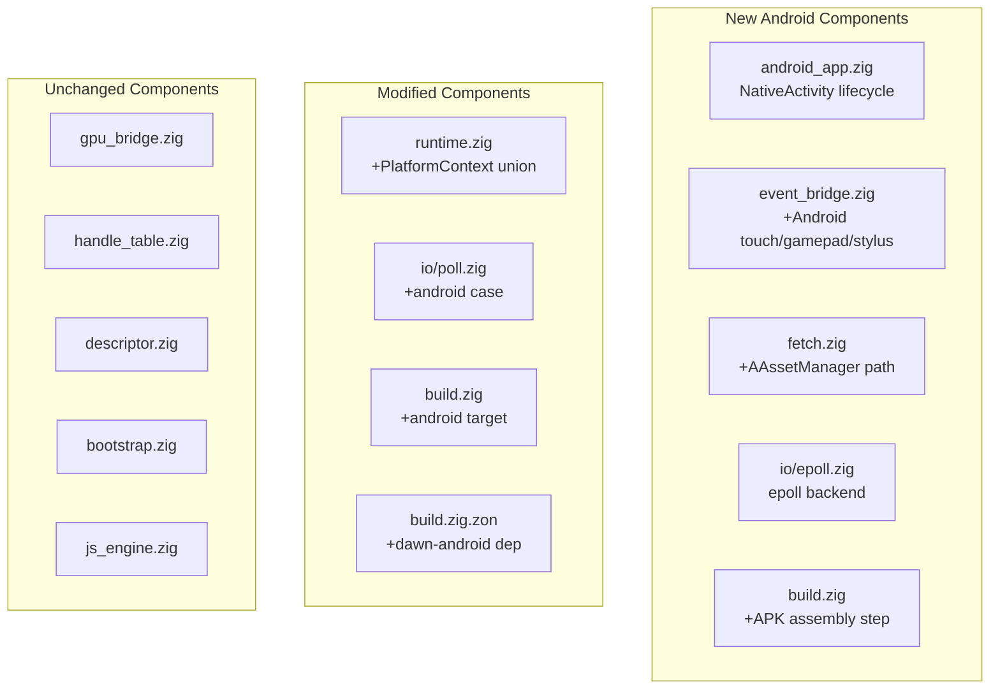

<!-- status: locked -->
<!-- epic-slug: android-port -->
# Tech Plan: Android Port

## Architecture Overview

The Android port adds a new platform backend alongside the existing GLFW-based desktop path. At compile time, `builtin.os.tag` selects between desktop (GLFW + io_uring/kqueue/IOCP) and Android (NativeActivity + epoll/io_uring). The GPU bridge, handle table, JS engine, descriptor translator, and TypeScript polyfills are platform-agnostic and remain unchanged.



**Key insight**: The existing `runtime.zig` orchestrates window creation, JS init, and the main loop. On Android, the same orchestration happens but driven by `android_native_app_glue` callbacks instead of a simple `while (!shouldClose)` loop.

## Design Decisions

| Decision | Choice | Rationale | Trade-off |
|----------|--------|-----------|-----------|
| Entry point | `android_main()` via `android_native_app_glue.c` | Standard NDK pattern. Small C file (~400 lines) compiled as part of build. | Must handle lifecycle state machine that desktop doesn't have. |
| Window abstraction | New `src/android_app.zig` providing same interface as `src/window.zig` | Keep runtime.zig changes minimal. Both provide: surface, dimensions, poll events. | Two parallel implementations to maintain. |
| Dawn surface | `wgpu::Surface` from `ANativeWindow*` via `VK_KHR_android_surface` | Dawn already supports this. zgpu needs a new `WindowProvider` variant for Android. | Must validate zgpu supports Android surface creation or patch it. |
| I/O backend | epoll as primary, io_uring as optional upgrade | epoll available on all Android versions. io_uring only on Android 12+ (kernel 5.10+). | Need a new `src/io/epoll.zig` backend. |
| Asset loading | AAssetManager for relative paths on Android | Transparent to JS — `fetch("model.glb")` works everywhere. | Need NDK headers for AAssetManager API. |
| NDK headers | Vendor minimal NDK headers (~5 files) into repo | Self-contained, no external NDK dependency. Matches project philosophy. | Must keep vendored headers in sync if NDK API changes (unlikely for stable APIs). |
| APK assembly | `aapt2` + `zipalign` + `apksigner` invoked from `build.zig` | No Gradle. Tools are standalone binaries from Android SDK command-line tools package. | Must download/manage SDK tools. User provides SDK path or we fetch. |
| GLFW conditionality | `zglfw` dependency skipped when target is `android` | GLFW doesn't support Android. Must not link it. | `build.zig` needs target-conditional dependency resolution. |

## Non-Negotiables / Invariants

- **No GPU ops without a valid ANativeWindow**: Between `TERM_WINDOW` and `INIT_WINDOW`, the GPU bridge must be suspended. Calling any wgpu function during this window causes UB.
- **JS event loop freezes on pause**: No rAF, no timers, no microtasks between `APP_CMD_PAUSE` and `APP_CMD_RESUME`.
- **Same JS code on all platforms**: The gltf-viewer.js demo must run unmodified on Android.
- **No Gradle**: APK is assembled entirely from `zig build`.

## Data Model

### Android App State (new)

```
AndroidApp {
    native_app:      *android.ANativeActivity    // from android_native_app_glue
    asset_manager:   *android.AAssetManager      // for APK file reads
    window:          ?*android.ANativeWindow      // null when window is lost
    window_width:    u32
    window_height:   u32
    state:           enum { created, window_ready, running, paused, window_lost, destroyed }
    input_queue:     ?*android.AInputQueue
    looper:          *android.ALooper
}
```

### Extended Platform Union in runtime.zig

```
PlatformContext = union {
    desktop: struct {
        window: *zglfw.Window
        gfx:    zgpu.GraphicsContext
    },
    android: struct {
        app:    *AndroidApp
        surface: wgpu.Surface
        device:  wgpu.Device
        // swapchain managed separately (recreated on window change)
    },
};
```

### Epoll I/O Backend (new)

```
EpollPoll {
    epoll_fd:    std.posix.fd_t
    events:      [256]std.os.linux.epoll_event
    completions: BoundedArray(Completion, 256)
}
```

Follows the same `IOPoll` interface as io_uring/kqueue/IOCP: `submit()`, `poll()`, returns `Completion` structs.

## Component Architecture



**android_app.zig**: Owns the NativeActivity lifecycle state machine. Provides `pollEvents()`, `getWindowDimensions()`, `getSurface()`. Compiles `android_native_app_glue.c` as a C dependency.

**event_bridge.zig modifications**: Add `translateAndroidInput(AInputEvent*) → DOMEvent` alongside existing GLFW callbacks. Touch events → PointerEvent, gamepad → GamepadEvent, stylus → PointerEvent with pressure/tilt.

**fetch.zig modifications**: On Android, `__native_readFileSync` checks AAssetManager first for relative paths. Falls back to `std.fs` for absolute paths. HTTP unchanged.

**io/epoll.zig**: New async I/O backend using `epoll_create1` + `epoll_ctl` + `epoll_wait`. File I/O is synchronous (like kqueue backend). Socket I/O is async via epoll.

**build.zig modifications**:
- Detect `target.os_tag == .linux` and `target.abi == .android`
- Skip zglfw dependency
- Link against NDK sysroot
- Add APK assembly step (aapt2, zipalign, apksigner)
- Add Dawn Android binary dependency

## File Changes

### New Files

| File | Purpose |
|------|---------|
| `src/android_app.zig` | NativeActivity lifecycle, window management, ALooper polling |
| `src/io/epoll.zig` | Epoll-based async I/O for Android (and potentially older Linux) |
| `src/android_native_app_glue.c` | Vendored from NDK (single C file, ~400 lines) |
| `src/android_native_app_glue.h` | Vendored header |
| `AndroidManifest.xml` | App manifest template (NativeActivity declaration, permissions) |
| `docs/specs/android-port/*.md` | These spec files |

### Modified Files

| File | Changes |
|------|---------|
| `build.zig` | Android target detection, skip zglfw, link NDK, APK assembly step, Dawn Android dep |
| `build.zig.zon` | Add `dawn-aarch64-linux-android` and `dawn-x86_64-linux-android` lazy deps |
| `src/runtime.zig` | Abstract over PlatformContext (desktop vs android). Entry point branching. Lifecycle callbacks. |
| `src/window.zig` | Guard with `if (builtin.os.tag != .linux or builtin.abi != .android)` or move to `src/desktop_window.zig` |
| `src/event_bridge.zig` | Add Android input translation (touch, gamepad, stylus → DOM events) |
| `src/polyfills/fetch.zig` | Add AAssetManager path for `__native_readFileSync` on Android |
| `src/io/poll.zig` | Add `.linux` + android abi → `epoll.zig` case (or runtime io_uring check) |
| `src/main.zig` | Android entry via `export fn android_main()` instead of `pub fn main()` |

### Unchanged Files

`gpu_bridge.zig`, `handle_table.zig`, `descriptor.zig`, `bootstrap.zig`, `js_engine.zig`, `polyfills.zig` (registration order), all TypeScript polyfills, all example JS files.

## Milestone Sequencing

| # | Milestone | Gate (what must pass) | Dependencies |
|---|-----------|----------------------|--------------|
| M0 | **Dawn Android Spike** | Dawn `.so` built for aarch64-linux-android. `wgpuCreateInstance()` succeeds on-device. | None — critical path blocker |
| M1 | **Cross-compile skeleton** | `zig build -Dtarget=aarch64-linux-android` produces a `.so` that loads on device (no rendering, just lifecycle logs via `__android_log_print`) | M0 |
| M2 | **APK packaging** | `zig build -Dtarget=aarch64-linux-android` produces an installable APK. App launches and shows NativeActivity. | M1 |
| M3 | **Dawn surface + triangle** | WebGPU surface from ANativeWindow. Clear color or triangle renders on screen. | M2 |
| M4 | **JS engine + bootstrap** | QuickJS runs on Android. Bootstrap polyfills load. `console.log` reaches logcat. | M1 |
| M5 | **Epoll I/O backend** | Async I/O works on Android. Fetch can read files. Event loop ticks. | M1 |
| M6 | **Asset loading** | `fetch("model.glb")` reads from APK assets via AAssetManager. | M4, M5 |
| M7 | **Touch input** | Single-finger rotate + pinch zoom + two-finger pan → PointerEvents → OrbitControls. | M4 |
| M8 | **glTF viewer running** | DamagedHelmet.glb renders on device with OrbitControls. | M3, M6, M7 |
| M9 | **Lifecycle robustness** | Pause/resume, home-button cycle, screen rotation all work without crash. | M8 |
| M10 | **Gamepad + stylus input** | Bluetooth gamepad and stylus input mapped to DOM events. | M7 |
| M11 | **x86_64 Android + polish** | Emulator target works. Both arch APKs build. Performance profiling. | M8 |

## Performance & Resource Budgets

| Metric | Target | Rationale |
|--------|--------|-----------|
| Frame rate | >= 30 fps at 1080p on Pixel 4a-class device | DamagedHelmet is ~4k tris, modest PBR. Should be GPU-trivial. |
| Startup time | < 3s from tap to first frame | QuickJS init + Dawn init + asset load. Desktop is ~1s; Android has APK overhead. |
| APK size | < 50 MB | Dawn .so (~15-20 MB) + assets (~5 MB) + bootstrap + app binary. |
| Memory | < 200 MB RSS | Dawn + QuickJS + textures. Desktop uses ~150 MB for DamagedHelmet. |

## Testing Strategy

- **Layer 1 — Unit tests**: Epoll backend tests (on Linux or Android emulator). AAssetManager mock for fetch tests. Android input → DOM event translation tests.
- **Layer 2 — On-device smoke test**: APK installs, launches, renders DamagedHelmet, responds to touch. Manual verification initially; Quickemu/emulator CI later.
- **Layer 3 — Regression**: All existing desktop tests must pass. Android-specific code guarded by `builtin.os.tag` / `builtin.abi` checks.

## Risks and Mitigations

| Risk | Likelihood | Impact | Mitigation |
|------|-----------|--------|------------|
| Dawn doesn't have Android prebuilts in zgpu | High | High (blocks everything) | M0 spike: build Dawn from source for Android. If GN/CMake Android build works, create prebuilt archive and add to build.zig.zon. |
| zgpu doesn't support Android surface creation | Medium | High | May need to patch zgpu to accept `ANativeWindow*` in `WindowProvider`. Fork if needed. |
| Zig's android target missing NDK headers | Medium | Medium | Vendor minimal NDK headers (android/native_activity.h, android/asset_manager.h, etc.) or use `@cImport` with NDK sysroot path. |
| io_uring unavailable on older Android kernels | High | Low | Epoll fallback is the primary path. io_uring is optional optimization. |
| QuickJS-NG has Android-specific issues | Low | Medium | QuickJS is portable C. The zig-quickjs-ng wrapper doesn't use platform APIs. Test early in M1. |
| APK assembly without Gradle is fragile | Medium | Medium | Use well-documented aapt2 + zipalign + apksigner flow. Many projects (e.g., zig-android) have proven this works. |
| Touch → OrbitControls mapping feels wrong | Medium | Low | Tunable in event_bridge. Can adjust sensitivity/thresholds post-M7. |

## Open Questions

1. **zgpu Android support**: Does zgpu's `GraphicsContext` already handle Android, or do we need to bypass it and use raw wgpu API for surface creation? Needs investigation in M0.
2. **Dawn version**: The zgpu-bundled Dawn version — does it include `VK_KHR_android_surface`? Or do we need a newer Dawn build?
3. **NDK API approach**: Vendor minimal headers vs. point at full NDK sysroot? Vendoring is self-contained but more work. NDK sysroot is complete but adds a dependency.
4. **Epoll vs io_uring on Android 12+**: Is the performance difference meaningful for our use case (mostly file reads and timers)? Probably not — epoll-only may be sufficient forever.
5. **Logging**: `console.log` goes to both logcat (`__android_log_print` with tag "threez") and a log file on device storage for post-hoc analysis.
