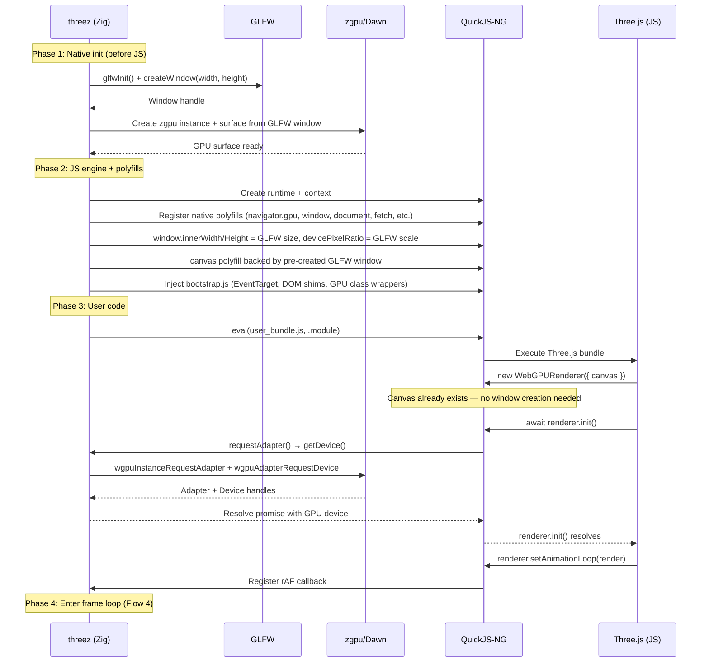
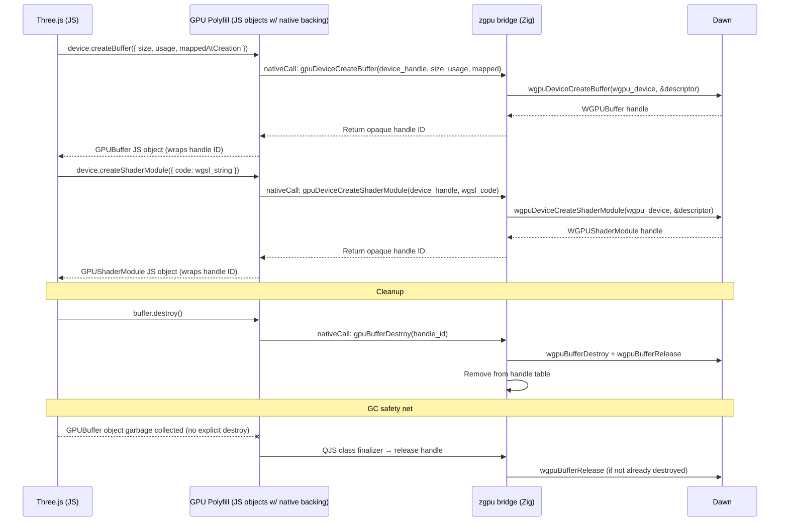
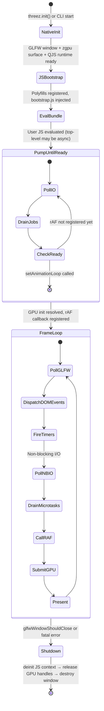

<!-- status: locked -->
# Core Flows: threez

## Design Decisions (from probing questions)

| Decision | Choice | Rationale |
|----------|--------|-----------|
| Window creation timing | Pre-create before JS eval | Zig creates GLFW window + zgpu surface during init, passes to canvas polyfill. Simpler than lazy creation. |
| Async I/O model | Non-blocking on main thread (epoll/kqueue) | No worker threads for I/O. Use Zig's non-blocking I/O with event loop polling. Single-threaded throughout. |
| WebGPU handle cleanup | Both explicit + GC safety net | `.destroy()` is immediate release. QuickJS class finalizers are backup for leaked handles. |
| Frame loop ownership | Zig owns the loop | Zig drives: poll GLFW → process events → drain JS microtasks → call rAF → submit GPU. JS registers callbacks, doesn't own the loop. |
| JS render error handling | Configurable | Default: log to stderr, skip frame, keep running. Option to fail fast (exit on first error). Configurable via CLI flag or init options. |

---

## Flow 1: Developer Build & Run (CLI Mode)

**Actor**: App developer
**Trigger**: Developer has a Three.js WebGPU project and wants to run it natively

1. Developer writes Three.js WebGPU code (standard, browser-compatible)
2. Developer bundles with esbuild: `esbuild src/main.js --bundle --format=esm --outfile=dist/bundle.js`
3. Developer downloads assets locally (glTF models, textures, etc.)
4. Developer runs: `threez run dist/bundle.js --assets ./assets/`
   - If bundle not found: error with path suggestion
   - If assets dir missing: warn, fetch may fail at runtime
5. threez opens a native window, initializes WebGPU via Dawn, evaluates the JS bundle
6. Three.js scene renders in the window with GPU acceleration
7. Developer interacts (orbit, resize, etc.) — sees native performance
8. Developer closes window or Ctrl+C to exit

**Success state**: Native window showing the Three.js scene, GPU-accelerated, responsive to input
**Error states**:
- JS eval error → print stack trace to stderr, exit 1
- WebGPU init failure → "No compatible GPU adapter found", exit 1
- Missing asset at fetch() → JS-level error (Three.js handles gracefully or throws)

## Flow 2: Library Embed Mode

**Actor**: App developer (Zig)
**Trigger**: Developer wants to embed threez in a Zig application with compile-time JS

1. Developer adds threez as a Zig dependency in `build.zig.zon`
2. Developer writes `build.zig` that embeds their JS bundle via `@embedFile`
3. Developer calls threez API: `threez.init(allocator, js_source, .{ .width = 1280, .height = 720 })`
4. threez creates window, initializes QuickJS + WebGPU, evaluates embedded JS
5. Developer calls `threez.runLoop()` which drives the frame loop
6. On window close, `threez.deinit()` cleans up

**Success state**: Same as CLI but embedded in a larger Zig application
**Error states**: Same as CLI, but errors returned as Zig error unions instead of exit codes

## Flow 3: Initialization Sequence

**Actors**: threez runtime (Zig), GLFW, zgpu/Dawn, QuickJS-NG, JS userland (Three.js)



**Key design**: Window and GPU surface are pre-created before any JS runs. The canvas polyfill wraps the existing GLFW window — `new WebGPURenderer({ canvas })` gets a canvas that's already backed by a real surface. No lazy window creation.

## Flow 4: Frame Loop & Event Dispatch

**Actors**: GLFW, threez event loop (Zig), QuickJS-NG, Three.js render loop

```mermaid
sequenceDiagram
    participant GLFW
    participant Loop as Event Loop (Zig)
    participant QJS as QuickJS-NG
    participant JS as Three.js (JS)

    loop Every frame (Zig owns this loop)
        Loop->>GLFW: glfwPollEvents()
        GLFW-->>Loop: Input events queue (mouse, keyboard, resize)

        Loop->>Loop: Convert GLFW events → DOM events
        Loop->>QJS: Dispatch events (pointerdown, pointermove, wheel, keydown, resize...)
        QJS->>JS: canvas.dispatchEvent(new PointerEvent(...))
        JS->>JS: OrbitControls handlers fire, update camera

        Loop->>Loop: Check timer queue (setTimeout/setInterval due?)
        Loop->>QJS: Fire expired timer callbacks

        Loop->>Loop: Poll non-blocking I/O (epoll/kqueue)
        Loop->>Loop: Process completed I/O → resolve JS promises
        Loop->>QJS: Run job queue (drain microtasks)

        Loop->>QJS: Call rAF callback(performance.now())
        QJS->>JS: render(timestamp)
        JS->>QJS: renderer.render(scene, camera)
        Note over QJS,Loop: WebGPU commands dispatched synchronously
        QJS->>Loop: createCommandEncoder → bindGroups → draw → submit
        Loop->>Loop: zgpu: command buffer submitted to Dawn
        Loop->>GLFW: present (vsync)
    end
```

**Zig owns the loop**. Each iteration:
1. Poll GLFW for OS events
2. Translate GLFW events → synthetic DOM events, dispatch to JS EventTarget listeners
3. Fire expired timers (setTimeout/setInterval)
4. Poll non-blocking I/O completions (file reads, HTTP) → resolve promises
5. Drain QuickJS microtask/job queue
6. Call registered requestAnimationFrame callback with `performance.now()` timestamp
7. JS render executes — WebGPU calls flow through to zgpu/Dawn synchronously
8. Present frame (vsync via GLFW swap)
9. Repeat until `glfwWindowShouldClose()`

**Error handling**: If JS throws during rAF callback:
- Default: log error + stack trace to stderr, skip frame, continue loop
- Strict mode (`--strict` or `.error_mode = .fail_fast`): log and exit
- Configurable at init time

## Flow 5: WebGPU API Bridge (JS → Zig → Dawn)

**Actors**: Three.js (JS), WebGPU polyfill objects, zgpu/Dawn (Zig)



**Pattern**: Every WebGPU JS object is a thin wrapper around an opaque Zig-side handle ID.

**Handle table** (Zig-side):
- Dense array of `?DawnHandle` indexed by integer ID
- Free list for ID reuse
- JS never sees raw pointers — only integer IDs
- Thread-safe not needed (single-threaded)

**Handle lifecycle**:
- **Create**: Dawn returns handle → Zig stores in handle table → returns integer ID to JS
- **Use**: JS passes ID on method calls → Zig looks up real handle → calls Dawn
- **Explicit destroy**: JS calls `.destroy()` → Zig calls Dawn destroy + release → mark slot free
- **GC safety net**: QuickJS class finalizer fires on GC → if handle still alive, release it → mark slot free
- **Double-free protection**: Handle slot tracks "destroyed" flag. Finalizer checks before releasing.

## Flow 6: Fetch & Asset Loading

**Actors**: Three.js loaders (JS), fetch polyfill, Zig non-blocking I/O

```mermaid
sequenceDiagram
    participant JS as GLTFLoader (JS)
    participant Fetch as fetch() polyfill
    participant Loop as Event Loop (Zig)
    participant IO as Non-blocking I/O (Zig)

    JS->>Fetch: fetch("assets/DamagedHelmet.glb")
    Fetch->>Fetch: Parse URL — local path or HTTP?
    alt Local file path
        Fetch->>Loop: Register non-blocking file read
        Loop->>IO: Open file fd, register with epoll/kqueue
        Note over Loop: Returns to frame loop immediately
        Loop->>Loop: Next poll iteration: fd ready
        IO-->>Loop: Read complete → bytes in buffer
        Loop->>Fetch: Resolve promise with Response
    else HTTP(S) URL
        Fetch->>Loop: Register non-blocking HTTP request
        Loop->>IO: std.http.Client connect + send (non-blocking)
        Note over Loop: Returns to frame loop immediately
        Loop->>Loop: Poll iterations: socket events
        IO-->>Loop: Response complete → bytes in buffer
        Loop->>Fetch: Resolve promise with Response
    else Data URI
        Fetch->>Fetch: Decode base64 inline (synchronous)
        Fetch-->>JS: Response with decoded bytes
    end
    Fetch-->>JS: Response object
    JS->>Fetch: response.arrayBuffer()
    Fetch-->>JS: ArrayBuffer with file contents
    JS->>JS: Parse glTF/GLB
```

**URL resolution**:
- Relative paths (`./model.glb`, `assets/texture.png`) → resolved against `--assets` dir or CWD
- Absolute paths (`/path/to/file`) → used directly
- HTTP(S) URLs (`https://example.com/model.glb`) → Zig std.http.Client, non-blocking
- Data URIs (`data:...`) → decoded inline (synchronous, common in glTF embedded textures)

**Response API** (minimal subset Three.js uses):
- `response.ok` — boolean
- `response.status` — number
- `response.arrayBuffer()` — returns Promise<ArrayBuffer>
- `response.json()` — returns Promise<object>
- `response.text()` — returns Promise<string>
- `response.blob()` — returns Promise<Blob> (if needed)
- `response.headers` — Map-like object (get/has)

## Flow 7: Image Decode Pipeline

**Actors**: Three.js texture system (JS), Image polyfill, zignal (Zig), zgpu (Zig)

```mermaid
sequenceDiagram
    participant JS as Three.js (JS)
    participant Img as Image/createImageBitmap polyfill
    participant Zignal as zignal (Zig)
    participant GPU as zgpu/Dawn

    alt new Image() path
        JS->>Img: const img = new Image(); img.src = "texture.png"
        Img->>Img: Trigger fetch for img.src (non-blocking)
        Note over Img: Fetch completes → bytes available
        Img->>Zignal: Decode PNG/JPEG bytes → RGBA pixels
        Zignal-->>Img: Pixel data (RGBA u8), width, height
        Img->>Img: Set .width, .height, .data
        Img->>JS: Fire "load" event on Image via EventTarget
    else createImageBitmap() path
        JS->>Img: createImageBitmap(blob)
        Img->>Zignal: Decode blob bytes → RGBA pixels
        Zignal-->>Img: Pixel data, width, height
        Img-->>JS: Resolve promise with ImageBitmap object
    end
    JS->>JS: Create THREE.Texture, set .image
    JS->>GPU: device.queue.writeTexture(pixelData, ...)
    GPU->>GPU: Upload RGBA data to GPU texture
```

**Supported formats (M1)**:
- PNG → zignal
- JPEG → zignal
- Data URI base64 PNG/JPEG → decode base64 → zignal

**Not supported (M2)**:
- UltraHDR (.hdr.jpg)
- HDR (.hdr) / EXR (.exr)
- KTX2 / compressed GPU textures

## Flow 8: DOM Event System

**Actors**: GLFW, Zig event bridge, JS EventTarget

```mermaid
sequenceDiagram
    participant GLFW
    participant Bridge as Event Bridge (Zig)
    participant ET as EventTarget (JS)
    participant OC as OrbitControls (JS)

    GLFW->>Bridge: cursorPosCallback(x, y)
    Bridge->>Bridge: Create PointerEvent { clientX, clientY, button, ... }
    Bridge->>ET: canvas.dispatchEvent(pointerEvent)
    ET->>ET: Walk listener list, call each handler
    ET->>OC: onPointerMove(event)
    OC->>OC: Update camera rotation

    GLFW->>Bridge: scrollCallback(xoffset, yoffset)
    Bridge->>Bridge: Create WheelEvent { deltaX, deltaY, ... }
    Bridge->>ET: canvas.dispatchEvent(wheelEvent)
    ET->>OC: onMouseWheel(event)
    OC->>OC: Update camera zoom

    GLFW->>Bridge: framebufferSizeCallback(w, h)
    Bridge->>Bridge: Update window.innerWidth/Height
    Bridge->>ET: window.dispatchEvent(new Event("resize"))
    ET->>JS: onWindowResize handler
    JS->>JS: camera.aspect = w/h; renderer.setSize(w, h)
```

**EventTarget implementation** (general, not minimal):
- `addEventListener(type, callback, options)` — supports capture, once, passive
- `removeEventListener(type, callback, options)`
- `dispatchEvent(event)` — synchronous dispatch, returns boolean
- Inheritable — window, document, canvas, Image all extend EventTarget

**GLFW → DOM event mapping**:

| GLFW Callback | DOM Event | Key Properties |
|---------------|-----------|----------------|
| `cursorPosCallback` | `pointermove` | clientX, clientY, movementX/Y, buttons |
| `mouseButtonCallback` | `pointerdown` / `pointerup` | clientX, clientY, button, buttons |
| `scrollCallback` | `wheel` | deltaX, deltaY, deltaMode |
| `keyCallback` | `keydown` / `keyup` | key, code, ctrlKey, shiftKey, altKey, metaKey |
| `framebufferSizeCallback` | `resize` on window | (window.innerWidth/Height updated before dispatch) |
| `cursorEnterCallback` | `pointerenter` / `pointerleave` | clientX, clientY |

**Event properties Three.js/OrbitControls actually reads**:
- PointerEvent: `clientX`, `clientY`, `button`, `pointerType`, `pointerId`
- WheelEvent: `deltaY` (OrbitControls zoom)
- KeyboardEvent: `key`, `code` (if keyboard controls enabled)
- Event: `type`, `target`, `preventDefault()`, `stopPropagation()`

## Flow 9: Event Loop Lifecycle



**Phases**:
- **NativeInit**: Create GLFW window, zgpu/Dawn instance + surface, QuickJS runtime + context
- **JSBootstrap**: Register native polyfill functions, inject bootstrap.js (EventTarget, DOM stubs, GPU class wrappers)
- **EvalBundle**: Evaluate user's esbuild bundle as ES module. Top-level code runs, may trigger async ops.
- **PumpUntilReady**: Mini event loop — poll I/O, drain microtasks, repeat until `setAnimationLoop` is called. This handles the `await renderer.init()` + `await loader.load()` phase before rendering begins.
- **FrameLoop**: Steady-state. Zig drives each frame. Runs until window close.
- **Shutdown**: Orderly cleanup. Destroy JS context (triggers all finalizers → releases GPU handles). Destroy zgpu surface + instance. Destroy GLFW window. Exit.
