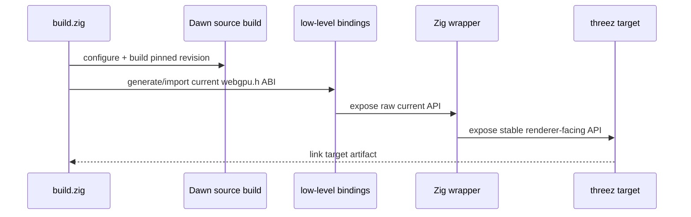
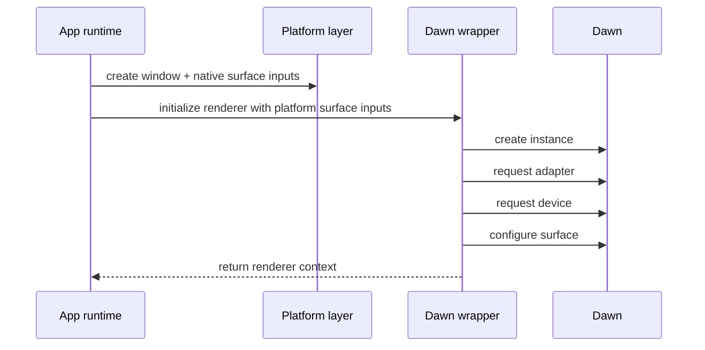
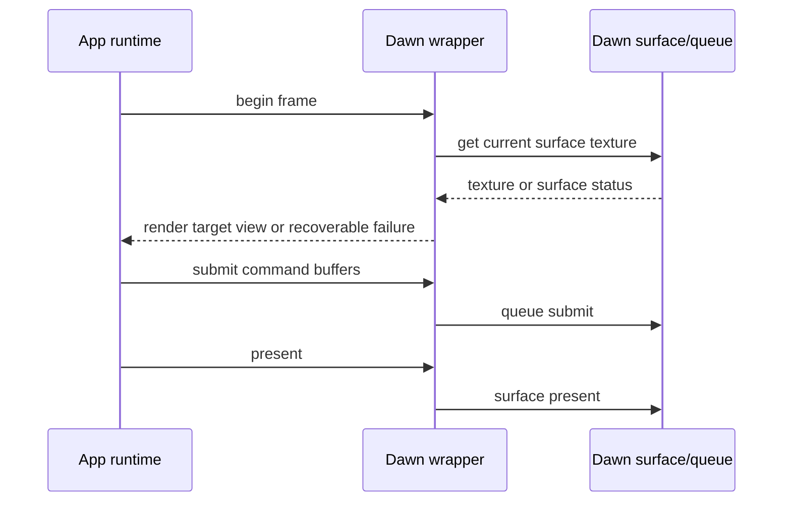
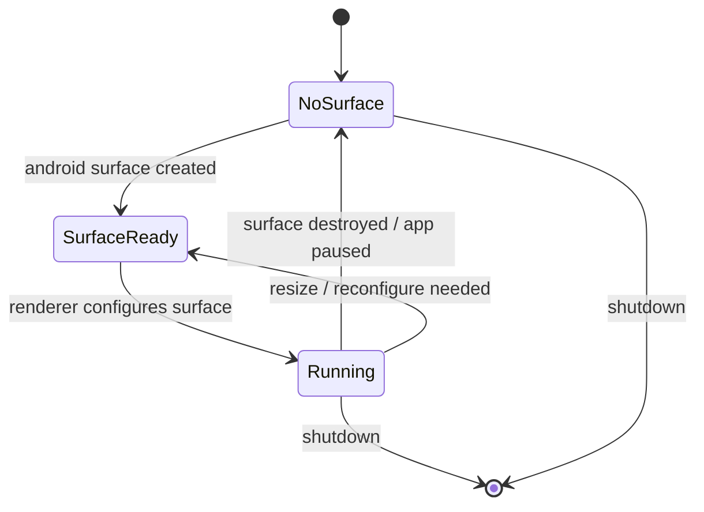

<!-- status: locked -->
# Core Flows: Dawn Wrapper Modernization

## Flow 1: Native build produces a current Dawn-backed renderer

**Actors**: Build system, Dawn source tree, generated low-level binding layer, handwritten Zig wrapper, app/runtime target
**Trigger**: A native target build is requested for Windows, Linux, or Android
**Preconditions**:

- Dawn source revision is pinned
- native toolchains exist for the target
- wrapper generation inputs come from the same `webgpu.h` revision used by the build

**Postconditions**:

- native target links against the same source-built Dawn revision
- low-level bindings and handwritten wrapper agree on the same C ABI
- app/runtime builds without legacy compatibility entrypoints

**Steps**:
1. `build.zig` selects a native target.
2. The build uses the pinned Dawn source dependency for that target.
3. The low-level binding layer imports the same pinned `webgpu.h` revision used by the Dawn build.
4. The handwritten Zig wrapper compiles against that current ABI without legacy entrypoint fallback.
5. The app/runtime links against the wrapper rather than stale legacy WebGPU entrypoints.

**Success state**:

- Windows, Linux, and Android all build through one current Dawn wrapper model.
- macOS remains best-effort through CI compile/run until direct hardware verification is available.

**Error states**:

- Build drift: Dawn revision and binding header revision diverge.
- ABI drift: wrapper still references removed entrypoints or outdated struct layouts.
- Platform-only hacks leak into the shared renderer path.

## Flow 2: Native runtime creates a renderer context

**Actors**: App runtime, platform layer, renderer wrapper, Dawn instance/adapter/device
**Trigger**: App startup on a native target
**Preconditions**:

- platform has created a valid native window/surface handle
- Dawn is initialized for the target backend

**Postconditions**:

- renderer context exists with explicit device lifetime
- platform and renderer responsibilities remain separated

**Invariants**:

- platform owns OS/window/lifecycle concerns
- renderer owns adapter/device/surface configuration concerns
- device lifetime is allowed to outlive surface lifetime on all native targets
- no legacy callback ABI or removed request entrypoint is used

**Steps**:
1. Platform creates native windowing objects and exposes surface creation inputs.
2. App asks renderer to initialize using those inputs.
3. Renderer creates Dawn instance, adapter, and device using the current API.
4. Renderer configures the surface for presentation.
5. Renderer waits for the current Dawn request lifecycle to complete and returns a ready context to the app/runtime.

**Success state**:

- app can acquire a frame and render without platform-specific ABI hacks
- app-facing init remains synchronous-looking even though Dawn request APIs are future/callback-based underneath

**Error states**:

- adapter or device request fails
- surface configuration fails
- platform supplied invalid surface inputs

## Flow 3: Frame acquire / submit / present

**Actors**: App runtime, renderer wrapper, Dawn surface/queue
**Trigger**: App renders a frame
**Preconditions**:

- renderer context is initialized
- surface is currently available

**Postconditions**:

- frame is either presented successfully or a recoverable surface-state result is returned

**Invariants**:

- frame acquisition is surface-based, not legacy swapchain-based
- resize / outdated / lost conditions are surfaced explicitly

**Success state**:

- frame renders and presents on every native target in scope

**Error states**:

- surface outdated or resized
- surface lost
- acquisition returns no usable texture

## Flow 4: Android lifecycle suspends and resumes the surface without redefining renderer ownership

**Actors**: Android platform layer, app runtime, renderer wrapper
**Trigger**: Android surface create/destroy, background/foreground, resize/rotation
**Preconditions**:

- device/adapter may outlive a given Android surface instance

**Postconditions**:

- surface-bound state is recreated when needed
- renderer/device lifetime rules stay explicit

**Steps**:
1. Android platform notifies app/runtime about surface availability changes.
2. Renderer configures when a surface becomes available.
3. Renderer stops frame acquisition and tears down surface-bound state when the surface is destroyed.
4. Renderer reconfigures on resume or resize without inventing a second ownership model.

**Success state**:

- Android lifecycle is handled by platform events plus renderer reconfiguration, not by renderer/platform entanglement

**Error states**:

- surface destruction causes stale frame resources to be reused
- renderer incorrectly couples device lifetime to short-lived Android surface lifetime
