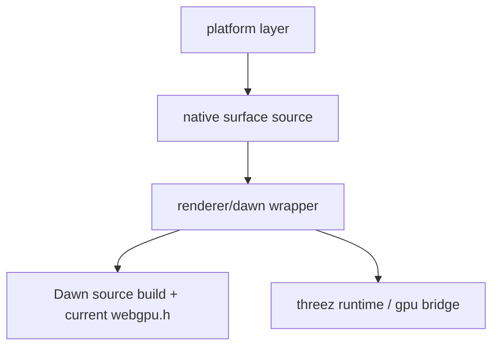
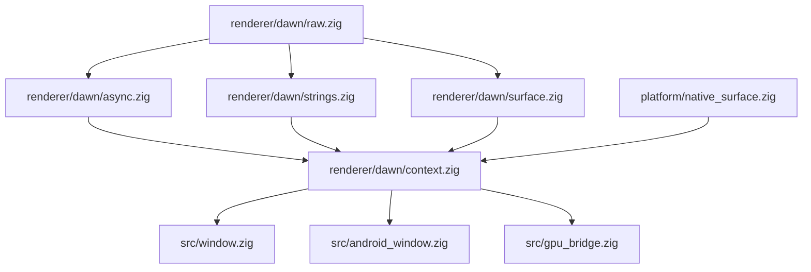

<!-- status: locked -->
# Tech Plan: Dawn Wrapper Modernization

## Architecture Overview

This epic replaces the repo's stale `zgpu`/handwritten `wgpu` dependency layer with a current Dawn-backed native renderer wrapper owned by `threez`.

The target architecture has three explicit layers:

1. **Platform layer**: OS/window/lifecycle/native-handle acquisition only
2. **Renderer wrapper**: current Dawn/WebGPU binding + Zig convenience layer
3. **App/runtime layer**: uses a synchronous-looking native renderer context and frame API

Two codebase facts drive this design:

- Android already source-builds Dawn in [build.zig](/home/autark/src/threez/build.zig), while desktop still relies on `zgpu` library path helpers and old wrapper expectations.
- Current `zgpu` surface creation and context ownership sit inside [zgpu.zig](/home/autark/src/threez/deps/zgpu/src/zgpu.zig), and app code reaches into that directly from [window.zig](/home/autark/src/threez/src/window.zig), [android_window.zig](/home/autark/src/threez/src/android_window.zig), and [gpu_bridge.zig](/home/autark/src/threez/src/gpu_bridge.zig).



Build architecture:

```mermaid
graph TD
    Build[build.zig] --> DawnBuild[source-built Dawn per native target]
    DawnBuild --> Headers[current webgpu.h + generated headers]
    Headers --> Raw[@cImport raw bindings]
    Raw --> Wrapper[handwritten Zig wrapper]
    Wrapper --> App[threez native targets]
```

## Design Decisions

| Decision | Choice | Rationale | Trade-off |
|----------|--------|-----------|-----------|
| Native Dawn dependency | Source-build for Windows, Linux, Android directly from `build.zig` | One pinned revision, no stale archives, same library/header story everywhere, no shell-script indirection | More `build.zig` complexity |
| Raw binding layer | `@cImport` of the pinned Dawn `webgpu.h` | Highest correctness, no generated Zig drift, always matches the actual header | Slower compile times, less pleasant raw API |
| High-level renderer API | Keep `GraphicsContext` name and synchronous-looking init/frame lifecycle | Minimizes churn above the wrapper and keeps current app/runtime semantics recognizable | Wrapper must own future/callback waiting correctly |
| Async bridging | Use current Dawn futures/callback-info structs and wait/process primitives without making startup appear frozen | Correct current API usage, no removed callback signatures, respects UX constraint | More wrapper complexity than the old proc API |
| Surface model | Surface-based acquire/configure/present, no legacy swapchain API | Matches current Dawn API and removes brittle compat shims | Requires touching current `gpu_bridge` frame path |
| Device vs surface lifetime | Device/queue/context outlive transient surfaces on all native targets | Correct model across platforms, mandatory for Android lifecycle | Requires explicit surface state handling |
| `zgpu` strategy | Replace it rather than preserve it | User does not care about preserving `zgpu`; current drift is the problem | Multi-file migration |
| macOS support | Best-effort via CI during this epic | No local hardware available; preserve current CI path | We cannot manually validate behavior |

## Non-Negotiables / Invariants

- Final native renderer path uses current Dawn/WebGPU APIs only.
- Final state ships without legacy compatibility shims for removed callback or swapchain entrypoints.
- Platform code does not own Dawn instance/device/queue policy.
- Renderer code does not own OS event loops or windowing concerns.
- All C API strings crossing the Dawn boundary are handled as `WGPUStringView`.
- Any Dawn-owned heap members returned through structs are released with the matching `FreeMembers` APIs.
- The frame path does not allocate heap memory on every frame under normal operation.
- Init may synchronously wait on Dawn request completion, but it must continue to process native events or otherwise preserve a responsive startup experience.

## Data Model

### `NativeSurfaceSource`

Tagged union of OS-native handles produced by the platform layer and consumed by the renderer wrapper.

```text
NativeSurfaceSource = union(enum) {
  android_native_window: *anyopaque,
  win32_hwnd: struct {
    hwnd: *anyopaque,
    hinstance: ?*anyopaque,
  },
  xlib_window: struct {
    display: *anyopaque,
    window: c_ulong,
  },
  wayland_surface: struct {
    display: *anyopaque,
    surface: *anyopaque,
  },
  metal_layer: *anyopaque,   // best-effort / macOS CI path
}
```

This is renderer-facing but platform-derived. It contains native handles only, not Dawn types.

### `RendererContext`

Long-lived renderer owner for one app/runtime instance.

```text
RendererContext {
  instance: raw.WGPUInstance
  adapter: raw.WGPUAdapter
  device: raw.WGPUDevice
  queue: raw.WGPUQueue
  adapter_info: AdapterInfoSnapshot
  surface_state: ?SurfaceState
  init_options: InitOptions
}
```

### `AdapterInfoSnapshot`

Stable copy of chosen adapter identity for logging and diagnostics.

```text
AdapterInfoSnapshot {
  vendor_id: u32
  device_id: u32
  backend_type: raw.WGPUBackendType
  adapter_type: raw.WGPUAdapterType
  vendor: []u8
  architecture: []u8
  device: []u8
  description: []u8
}
```

Owned strings are copied once during init, then `wgpuAdapterInfoFreeMembers` is called on the raw struct.

### `SurfaceState`

Short-lived or replaceable presentation state tied to a platform surface.

```text
SurfaceState {
  source: NativeSurfaceSource
  surface: raw.WGPUSurface
  config: raw.WGPUSurfaceConfiguration
  width: u32
  height: u32
  format: raw.WGPUTextureFormat
  present_mode: raw.WGPUPresentMode
}
```

### `AcquiredFrame`

Represents one acquired presentable texture.

```text
AcquiredFrame {
  texture: raw.WGPUTexture
  view: raw.WGPUTextureView
  status: enum {
    ok,
    suboptimal,
    timeout,
    outdated,
    lost,
    error,
  }
}
```

### `RequestLatch(T)`

Small helper used internally by the wrapper to bridge current Dawn callback-info/future APIs into synchronous-looking init and queue completion behavior.

```text
RequestLatch(T) {
  done: bool
  status: enum/int from Dawn callback
  value: ?T
  message: ?[]u8
}
```

Implementation detail:

- created on the stack or in explicit owner storage
- callback writes result
- wrapper waits using current Dawn instance wait/process primitives

## Component Architecture



### `renderer/dawn/raw.zig`

Thin raw import of `dawn/webgpu.h` via `@cImport`. No policy. No convenience wrappers beyond namespacing.

### `renderer/dawn/strings.zig`

Helpers for:

- `[]const u8` -> `WGPUStringView`
- nullable label handling
- copying/freeing raw string-view results into Zig-owned slices

### `renderer/dawn/async.zig`

Helpers that encapsulate:

- request adapter
- request device
- queue work completion waits
- pop error scope waits if needed later

This is where callback-info structs and `wgpuInstanceWaitAny` / `wgpuInstanceProcessEvents` live.

Policy:

- default native path uses `AllowProcessEvents` where supported
- wait loops are bounded and continue processing events
- startup must not visually deadlock the app while adapter/device requests complete

### `renderer/dawn/surface.zig`

Owns:

- converting `NativeSurfaceSource` into current Dawn `WGPUSurfaceDescriptor` chains
- surface configure / unconfigure
- current texture acquisition
- present
- resize / outdated / lost result mapping

This replaces the old `SwapChain` assumption used in [wgpu.zig](/home/autark/src/threez/deps/zgpu/src/wgpu.zig) and [gpu_bridge.zig](/home/autark/src/threez/src/gpu_bridge.zig).

### `renderer/dawn/context.zig`

Owns:

- instance / adapter / device / queue lifecycle
- adapter info snapshotting
- surface-state attach / detach / reconfigure
- public renderer-facing API used by windows and runtime code

### `platform/native_surface.zig`

Small shared abstraction for native OS handles. Existing platform sources remain responsible for obtaining those handles:

- desktop GLFW handles from [window.zig](/home/autark/src/threez/src/window.zig)
- Android `ANativeWindow*` from [android_window.zig](/home/autark/src/threez/src/android_window.zig)

## Interfaces & Compatibility

Public compatibility strategy:

- do **not** preserve `zgpu` as a dependency boundary
- do preserve a small synchronous-looking `GraphicsContext`-style API for app/runtime code to minimize churn above the renderer layer

Proposed internal public surface:

```text
RendererContext.create(allocator, native_surface_source, options) !*RendererContext
RendererContext.destroy(...)
RendererContext.getDevice()
RendererContext.getQueue()
RendererContext.getSurface()
RendererContext.acquireFrame() !AcquiredFrame
RendererContext.present(...)
RendererContext.reconfigureSurface(...)
RendererContext.detachSurface(...)
```

Migration rule:

- `window.zig`, `android_window.zig`, and `gpu_bridge.zig` should depend on the new internal renderer module instead of `zgpu`

## Performance & Resource Budgets

- Build time may increase because all native targets source-build Dawn. This is acceptable.
- Init may block during adapter/device acquisition. This is acceptable because correctness outranks startup speed in this epic.
- Normal frame acquire/present must avoid heap allocation.
- Surface reconfiguration work is allowed on resize, surface loss, or lifecycle transitions only.

## Observability & Diagnostics

- Log selected adapter info on every native target.
- Log request adapter / request device statuses and failure messages.
- Log surface acquire statuses: success, suboptimal, outdated, lost, error.
- Keep shader-module logging in [gpu_bridge.zig](/home/autark/src/threez/src/gpu_bridge.zig) until Android crash diagnosis is complete.
- Keep Android logcat-friendly tags stable (`threez` / scoped Zig logs).

## Existing Code Evidence

- Source-built Dawn is already wired only for Android in [build.zig](/home/autark/src/threez/build.zig) and [build-dawn-android.sh](/home/autark/src/threez/scripts/build-dawn-android.sh).
- Old wrapper assumptions are concentrated in [wgpu.zig](/home/autark/src/threez/deps/zgpu/src/wgpu.zig): old swapchain API, old callback signatures, old descriptor layouts.
- Existing surface creation logic already exists conceptually in [zgpu.zig](/home/autark/src/threez/deps/zgpu/src/zgpu.zig) via `createSurfaceForWindow`, with desktop handles sourced from [window.zig](/home/autark/src/threez/src/window.zig) and Android handles from [android_window.zig](/home/autark/src/threez/src/android_window.zig).
- App/runtime code reaches directly into `zgpu` from [window.zig](/home/autark/src/threez/src/window.zig), [android_window.zig](/home/autark/src/threez/src/android_window.zig), [android_app.zig](/home/autark/src/threez/src/android_app.zig), [android_runtime.zig](/home/autark/src/threez/src/android_runtime.zig), and [gpu_bridge.zig](/home/autark/src/threez/src/gpu_bridge.zig).
- `dawn.cpp` is currently only a thin native-instance bridge in [dawn.cpp](/home/autark/src/threez/deps/zgpu/src/dawn.cpp), making it a candidate for deletion if the pure current C API suffices.

## File Changes

### New Files

- `src/renderer/dawn/raw.zig` — `@cImport` raw Dawn/WebGPU bindings
- `src/renderer/dawn/strings.zig` — `WGPUStringView` helpers and owned-string conversion
- `src/renderer/dawn/async.zig` — callback-info + future waiting helpers
- `src/renderer/dawn/surface.zig` — surface creation, configure, acquire, present, teardown
- `src/renderer/dawn/context.zig` — long-lived renderer context
- `src/platform/native_surface.zig` — native-handle abstraction shared by platform code

### Modified Files

- `build.zig` — native Dawn source build for Windows/Linux/Android; remove `zgpu` Dawn linkage path and own the full Dawn build orchestration directly
- `build.zig.zon` — dependency cleanup if `zgpu` is removed or narrowed
- `src/window.zig` — stop creating `zgpu.GraphicsContext`; create new renderer context
- `src/android_window.zig` — stop creating `zgpu.GraphicsContext`; use new renderer context and explicit surface lifecycle
- `src/android_app.zig` — remove direct `zgpu.wgpu` assumptions
- `src/android_runtime.zig` — swap renderer context import
- `src/gpu_bridge.zig` — replace swapchain-based frame acquisition with current surface acquire/present model
- `src/runtime.zig` — consume the new renderer context where needed
- `src/ts/bootstrap/gpu.ts` — only if comments/assumptions about `zgpu` leak into runtime semantics
- `src/ts/dist/bootstrap.js` — generated counterpart if the TypeScript source changes

### Deleted Files / Deleted Responsibilities

- `src/android_wgpu_shim.c` — remove legacy compatibility entrypoint shims from final state
- `deps/zgpu/src/wgpu.zig` — remove as active binding layer
- `deps/zgpu/src/zgpu.zig` — remove as active renderer context implementation
- `deps/zgpu/src/dawn_proc.c` — remove if direct current C API is used everywhere
- `deps/zgpu/src/dawn.cpp` — remove if `wgpuCreateInstance` and current C API fully replace it

## Milestone Sequencing

| # | Milestone | Gate |
|---|-----------|------|
| 1 | Native Dawn source build convergence | Windows, Linux, Android all build against one pinned Dawn source path via `build.zig` |
| 2 | Raw binding + async wrapper foundation | `@cImport` raw layer compiles; adapter/device requests work on at least one desktop target |
| 3 | New renderer context + surface model | New internal renderer context can create device, configure surface, acquire/present frame |
| 4 | Desktop migration | Windows and Linux app paths boot and render without `zgpu` |
| 5 | Android migration | Android boots through the new wrapper and reaches meaningful post-wrapper runtime behavior |
| 6 | Cleanup | `zgpu` renderer path and legacy shims removed from active native code path |

## Testing Strategy

- **Layer 1 — Wrapper smoke tests**
  - compile raw binding layer on all native targets
  - verify request adapter/device helpers complete correctly
  - verify adapter info member ownership/free path

- **Layer 2 — Platform integration tests**
  - Linux/Windows: app boots and renders through existing sample/runtime path
  - Android: APK builds, installs, launches, and reaches render path
  - macOS: CI compile/run remains green where available

- **Layer 3 — Reference runtime checks**
  - glTF viewer boots and renders on native targets in scope
  - Android crash reproduction is re-evaluated only after wrapper migration gates are green
  - Epic completion is acceptable if Android reaches the original post-wrapper bug cleanly, even if the Android rendering bug itself remains for follow-up work

## Risks and Mitigations

| Risk | Likelihood | Impact | Mitigation |
|------|-----------|--------|------------|
| `@cImport` setup differs across native targets | Medium | High | Keep raw layer tiny; ensure `build.zig` adds exact Dawn include paths, including generated headers |
| Current Dawn async request flow is mishandled | Medium | High | Centralize wait/process logic in one helper module and test it first |
| Surface migration breaks `gpu_bridge` assumptions | High | High | Introduce a small `acquireFrame` abstraction before touching broader runtime code |
| Scope balloons into full renderer rewrite | Medium | High | Keep app-facing API small and synchronous-looking; migrate only what the runtime actually uses |
| macOS regressions go unnoticed | Medium | Medium | Preserve CI run path and treat macOS as best-effort in this epic |
| Startup appears frozen during adapter/device acquisition | Medium | Medium | Use process-events-capable waits and preserve visible startup responsiveness during init |

## Open Questions

- Can `dawn.cpp` be deleted entirely after the wrapper moves to the current C API?
- Does the existing Android shader-module instrumentation remain useful after the wrapper migration, or should it move behind a dedicated debug flag?
