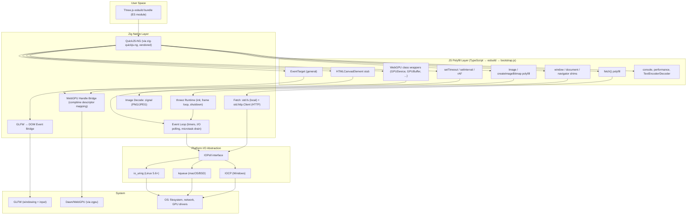
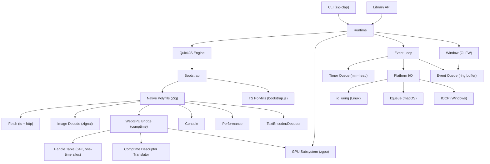

<!-- status: locked -->
# Tech Plan: threez

## Architecture Overview

threez is a layered system. Zig is the host. QuickJS-NG runs JS. A polyfill layer bridges browser APIs to native implementations. zgpu/Dawn provides the WebGPU backend.



**Data flow**: JS calls browser APIs → polyfill layer dispatches to Zig native functions → Zig calls zgpu/Dawn, GLFW, or platform I/O → results returned to JS as values or resolved promises.

## Design Decisions

| Decision | Choice | Rationale | Trade-off |
|----------|--------|-----------|-----------|
| Polyfill registration | QuickJS class system for WebGPU objects, global functions for simple APIs | Class system gives us finalizers (GC safety net), prototype methods, proper `instanceof`. Simple APIs (fetch, console) are just global functions. | More setup code per WebGPU class, but correct semantics |
| Handle bridge pattern | Integer handle IDs, dense array + free list, 64K pre-alloc | JS never sees raw pointers. Cache-friendly. O(1) lookup. Free list avoids fragmentation. 64K one-time alloc, configurable. | Fixed upper bound, but 64K covers any reasonable scene |
| Bootstrap language | TypeScript (tsc manual checks) → esbuild → bootstrap.js | Type safety for complex polyfill code. tsc for validation, esbuild for bundling. Can grow to full npm package if needed. | Extra build step, but catches bugs in polyfill layer |
| WebGPU descriptor translation | Comptime Zig metaprogramming | Reflect on Dawn struct fields at comptime, auto-read matching JS properties. One generic function handles all descriptor types. | Comptime complexity, but eliminates hand-written boilerplate for ~30+ descriptor types |
| Platform I/O | io_uring (Linux), kqueue (macOS), IOCP (Windows) | True async for ALL I/O including regular files. Platform abstraction from day one. | More upfront work, but correct on all platforms. No "epoll doesn't work for files" surprise. |
| HTTP I/O | Zig std.http.Client via platform I/O abstraction | stdlib, no extra deps. Socket fds registered with io_uring/kqueue/IOCP. | std.http.Client may need adaptation for non-blocking mode |
| Error mode | Configurable: resilient (default) vs strict | Resilient skips frames on JS errors. Strict exits. CLI flag `--strict`. Library option `.error_mode`. | Must catch errors at every JS→Zig boundary |
| CLI arg parsing | zig-clap | Battle-tested, Zig-native, comptime argument definitions | Extra dependency, but trivial |
| Three.js version | Pin latest at implementation time, track upstream per semver | Pin a specific commit hash. Update hash when moving to next semver. Ensures reproducible builds. | Must manually track Three.js releases |

## Data Model

### Core Runtime

```
Runtime {
    allocator:       std.mem.Allocator
    qjs_runtime:     *quickjs.Runtime
    qjs_context:     *quickjs.Context
    gpu_instance:    zgpu.Instance
    gpu_adapter:     zgpu.Adapter
    gpu_device:      zgpu.Device
    gpu_surface:     zgpu.Surface
    glfw_window:     *glfw.Window
    handle_table:    HandleTable
    event_loop:      EventLoop
    config:          Config
}

Config {
    width:           u32 = 1280
    height:          u32 = 720
    title:           []const u8 = "threez"
    assets_dir:      ?[]const u8 = null        // --assets flag
    error_mode:      enum { resilient, strict } = .resilient
    vsync:           bool = true
    max_handles:     u32 = 65536               // handle table capacity, configurable
}
```

### Handle Table (WebGPU Object Bridge)

```
HandleTable {
    entries:         []HandleEntry              // one-time alloc, config.max_handles slots
    free_head:       ?u32                       // head of free list
    count:           u32                        // active handles
    capacity:        u32                        // = config.max_handles (default 64K)
}

HandleEntry {
    handle:          DawnHandle                 // tagged union of all Dawn handle types
    handle_type:     HandleType
    generation:      u16                        // ABA protection
    alive:           bool
    destroyed:       bool                       // explicit .destroy() called
}

HandleId {
    index:           u32
    generation:      u16                        // must match entry.generation
}

HandleType = enum {
    adapter, device, queue,
    buffer, texture, texture_view, sampler,
    shader_module, bind_group_layout, bind_group,
    pipeline_layout, render_pipeline, compute_pipeline,
    command_encoder, render_pass_encoder, compute_pass_encoder,
    command_buffer, query_set,
}
```

### Platform I/O Abstraction

```
// Compile-time dispatched interface — zero overhead
IOPoll = switch (builtin.os.tag) {
    .linux   => IoUringPoll,
    .macos   => KqueuePoll,
    .windows => IocpPoll,
    else     => @compileError("unsupported platform"),
};

// Uniform interface all backends implement:
IOPoll.Methods {
    init(allocator) → IOPoll
    deinit()
    submitRead(fd, buffer, userdata) → void         // async file read
    submitConnect(socket, addr, userdata) → void     // async socket connect
    submitRecv(socket, buffer, userdata) → void      // async socket read
    submitSend(socket, buffer, userdata) → void      // async socket write
    poll(timeout_ms) → []Completion                  // drain completions
}

Completion {
    userdata:        *anyopaque                 // maps back to PendingIO
    result:          i32                        // bytes read, or error
    op_type:         OpType
}

IoUringPoll {
    ring:            std.os.linux.IoUring
    // Uses io_uring SQE/CQE for all ops
    // IORING_OP_READ for files, IORING_OP_CONNECT/RECV/SEND for sockets
}

KqueuePoll {
    kq_fd:           std.posix.fd_t
    // Uses EVFILT_READ/EVFILT_WRITE for sockets
    // For files: kqueue doesn't support regular files —
    //   use preadv with immediate completion (files are always "ready")
    //   or dispatch to a small thread for true async file reads
}

IocpPoll {
    iocp_handle:     windows.HANDLE
    // Uses ReadFile/WSARecv with OVERLAPPED
    // True async for both files and sockets on Windows
}
```

### Event Loop

```
EventLoop {
    timer_queue:     TimerQueue                // min-heap by fire_time
    io_poll:         IOPoll                    // platform-specific async I/O
    pending_events:  EventQueue                // GLFW events → DOM events
    pending_io:      PendingIOTable            // maps completions → JS promises
    raf_callback:    ?quickjs.Value            // registered rAF function
    raf_registered:  bool
    start_time_ns:   i128                      // for performance.now()
}

TimerEntry {
    id:              u32
    fire_time_ms:    f64
    interval_ms:     ?f64                      // null for setTimeout, value for setInterval
    callback:        quickjs.Value             // JS function ref (prevent GC)
}

PendingIOEntry {
    promise:         quickjs.Value             // JS promise to resolve on completion
    buffer:          []u8                      // read buffer
    op_type:         enum { file_read, http_request }
    state:           enum { submitted, completed, error }
}
```

### DOM Shims (TypeScript, in src/ts/bootstrap/)

```
// TypeScript source files, compiled to bootstrap.js via esbuild.
// tsc used for type checking only (manual `tsc --noEmit`).
// Listed here to define the contract.

EventTarget {
    _listeners: Map<string, Array<{callback, capture, once, passive}>>
    addEventListener(type, callback, options?)
    removeEventListener(type, callback, options?)
    dispatchEvent(event) → boolean
}

Event {
    type: string
    target: EventTarget
    currentTarget: EventTarget
    bubbles: boolean
    cancelable: boolean
    defaultPrevented: boolean
    preventDefault()
    stopPropagation()
    stopImmediatePropagation()
    timeStamp: number      // performance.now() at creation
}

PointerEvent extends Event {
    clientX, clientY: number
    movementX, movementY: number
    button: number         // 0=left, 1=middle, 2=right
    buttons: number        // bitmask
    pointerId: number
    pointerType: "mouse"
}

WheelEvent extends Event {
    deltaX, deltaY, deltaZ: number
    deltaMode: number      // 0=pixel
}

KeyboardEvent extends Event {
    key: string
    code: string
    ctrlKey, shiftKey, altKey, metaKey: boolean
    repeat: boolean
}

// Minimal DOM tree (not a real DOM, just enough for Three.js)
window → extends EventTarget {
    innerWidth, innerHeight: number
    devicePixelRatio: number
    navigator: { gpu: GPUPolyfill }
    document: Document
    performance: { now() }
    setTimeout, setInterval, clearTimeout, clearInterval
    requestAnimationFrame
}

document → extends EventTarget {
    body: { appendChild: no-op }
    createElement(tag) → if "canvas" return canvas stub, else no-op stub
}

canvas → extends EventTarget {
    width, height: number
    getContext("webgpu") → { configure(), getCurrentTexture(), ... }
    style: {}              // no-op property bag
    getBoundingClientRect() → { left: 0, top: 0, width, height }
}
```

### WebGPU Polyfill Classes (TypeScript, native-backed)

```
// Each class wraps a native handle ID.
// Methods call __native.gpuXxx() functions registered from Zig.
// Finalizer (registered via Zig class system) releases handle on GC.

GPU {
    requestAdapter(options?) → Promise<GPUAdapter>
}

GPUAdapter {
    _handle: number        // HandleId serialized as u32|u16 packed
    requestDevice(descriptor?) → Promise<GPUDevice>
    features: GPUSupportedFeatures
    limits: GPUSupportedLimits
}

GPUDevice {
    _handle: number
    queue: GPUQueue
    createBuffer(descriptor) → GPUBuffer
    createTexture(descriptor) → GPUTexture
    createSampler(descriptor) → GPUSampler
    createShaderModule(descriptor) → GPUShaderModule
    createBindGroupLayout(descriptor) → GPUBindGroupLayout
    createBindGroup(descriptor) → GPUBindGroup
    createPipelineLayout(descriptor) → GPUPipelineLayout
    createRenderPipeline(descriptor) → GPURenderPipeline
    createComputePipeline(descriptor) → GPUComputePipeline
    createCommandEncoder(descriptor?) → GPUCommandEncoder
    destroy()
}

GPUBuffer {
    _handle: number
    mapAsync(mode, offset?, size?) → Promise
    getMappedRange(offset?, size?) → ArrayBuffer
    unmap()
    destroy()
    size: number (readonly)
    usage: number (readonly)
}

// ... similar pattern for GPUTexture, GPURenderPipeline, GPUCommandEncoder,
// GPURenderPassEncoder, GPUComputePassEncoder, GPUQueue, etc.
// Each wraps a handle and forwards method calls to __native.gpuXxx() functions.
```

### Comptime Descriptor Translation

```
// Core pattern: given a Dawn struct type (e.g. wgpu.BufferDescriptor),
// read matching properties from a JS object at runtime using comptime reflection.

fn translateDescriptor(
    comptime DawnType: type,
    ctx: *quickjs.Context,
    js_obj: quickjs.Value,
) !DawnType {
    var result: DawnType = std.mem.zeroes(DawnType);
    inline for (std.meta.fields(DawnType)) |field| {
        const js_val = js_obj.getPropertyStr(ctx, field.name);
        defer js_val.deinit(ctx);
        if (!js_val.isUndefined()) {
            @field(result, field.name) = try convertJSToZig(field.type, ctx, js_val);
        }
    }
    return result;
}

// Handles: primitives, enums, nested structs, arrays, string → [*:0]const u8
// Special cases: handle ID fields → look up real Dawn handle from HandleTable
```

## Component Architecture



**Components**:

- **CLI**: zig-clap arg parsing. `threez run <bundle.js> [--assets <dir>] [--width N] [--height N] [--strict] [--max-handles N]`. Calls Runtime.init() + Runtime.runLoop().

- **Library API**: Public Zig API. `init(allocator, js_source, config) → Runtime`, `runLoop()`, `deinit()`. For embedding in Zig apps.

- **Runtime**: Orchestrator. Owns all subsystems. Manages lifecycle (init → bootstrap → eval → loop → shutdown). Single struct, single owner.

- **QuickJS Engine**: Thin wrapper around zig-quickjs-ng (vendored, patched to 0.15.x). Creates runtime + context. Provides eval, value creation, class registration, job queue drain.

- **Bootstrap**: Two-phase polyfill registration. Phase 1: register native `__native.gpuXxx()` functions from Zig. Phase 2: eval compiled bootstrap.js (from TypeScript) that builds EventTarget, DOM shims, GPU class wrappers wired to native functions.

- **WebGPU Bridge + Comptime Descriptor Translator**: The core bridge. Uses comptime reflection to auto-translate JS descriptor objects into Dawn C structs. Maps JS handle IDs ↔ Dawn handles. No hand-written per-descriptor-type boilerplate.

- **Handle Table**: 64K entries, one-time alloc (configurable via `config.max_handles`). Dense array + free list + generation counter. Single owner, no thread safety needed.

- **Platform I/O**: Compile-time dispatched abstraction. io_uring on Linux (true async for files + sockets), kqueue on macOS (sockets async, files via immediate preadv or small thread), IOCP on Windows (true async for everything). Uniform `submitRead/submitConnect/submitRecv/poll` interface.

- **Event Loop**: Zig-owned frame loop. Each tick: poll GLFW → translate events → fire timers → poll I/O completions → drain microtasks → call rAF → submit GPU → present.

- **Timer Queue**: Min-heap ordered by fire_time. setTimeout (one-shot) and setInterval (repeating). Returns timer IDs for clear*.

- **Event Queue**: Ring buffer. GLFW callbacks push events. Frame loop dispatches them to JS EventTarget.

- **Fetch**: URL parser → local file or HTTP. Local: submit async read via IOPoll. HTTP: connect socket via IOPoll, handle HTTP protocol state machine, resolve promise. Response implements arrayBuffer/json/text/blob.

- **Image Decode**: zignal integration. PNG/JPEG → RGBA u8 pixels + dimensions. Used by Image polyfill ("load" event) and createImageBitmap (promise).

- **Console**: console.log/warn/error/info → stdout/stderr with basic formatting.

- **Performance**: `performance.now()` → `std.time.nanoTimestamp()` delta from init, as f64 milliseconds.

- **TextEncoder/Decoder**: UTF-8 passthrough (QuickJS strings are UTF-8 internally).

## File Layout

```
threez/
├── build.zig                        # Build: deps, compile targets, CLI + lib, bootstrap.js embed
├── build.zig.zon                    # Deps: zig-quickjs-ng (vendored), zgpu, zignal, zig-clap
├── src/
│   ├── main.zig                     # CLI entry point (zig-clap → Runtime.init → runLoop)
│   ├── runtime.zig                  # Runtime struct: init, runLoop, deinit, lifecycle
│   ├── event_loop.zig               # Frame loop: tick, timer queue, I/O poll, microtask drain
│   ├── js_engine.zig                # QuickJS wrapper: runtime/context, eval, class registration
│   ├── bootstrap.zig                # Polyfill registration (native) + bootstrap.js injection
│   ├── handle_table.zig             # Dense array, free list, generation counter, 64K default
│   ├── gpu_bridge.zig               # WebGPU JS↔Zig bridge: comptime descriptor translation
│   ├── descriptor.zig               # Comptime descriptor translator (translateDescriptor generic)
│   ├── event_bridge.zig             # GLFW → DOM event translation + JS EventTarget dispatch
│   ├── polyfills/
│   │   ├── fetch.zig                # fetch(): URL parse, local fs read, HTTP client
│   │   ├── image.zig                # Image + createImageBitmap: zignal decode
│   │   ├── console.zig              # console.log/warn/error → stdout/stderr
│   │   ├── performance.zig          # performance.now() → high-res timer
│   │   ├── timers.zig               # setTimeout, setInterval, clearTimeout, clearInterval
│   │   └── encoding.zig             # TextEncoder, TextDecoder
│   └── io/
│       ├── poll.zig                 # Platform dispatch: comptime switch → backend
│       ├── io_uring.zig             # Linux io_uring backend
│       ├── kqueue.zig               # macOS/BSD kqueue backend
│       └── iocp.zig                 # Windows IOCP backend
├── src/ts/                          # TypeScript polyfill sources
│   ├── tsconfig.json                # tsc config (noEmit, strict, ES2023 target)
│   ├── bootstrap/
│   │   ├── index.ts                 # Entry: wire everything together
│   │   ├── event-target.ts          # EventTarget, Event, PointerEvent, WheelEvent, KeyboardEvent
│   │   ├── dom.ts                   # window, document, canvas stubs
│   │   ├── gpu.ts                   # WebGPU class wrappers (GPUDevice, GPUBuffer, etc.)
│   │   ├── fetch.ts                 # Response class (wraps native fetch result)
│   │   └── image.ts                 # Image, createImageBitmap wrappers
│   ├── package.json                 # esbuild + typescript as devDeps
│   └── esbuild.config.mjs           # Bundle bootstrap/ → bootstrap.js (single file)
├── examples/
│   └── gltf_viewer/
│       ├── src/
│       │   └── main.ts              # webgpu_loader_gltf demo (adapted, TypeScript)
│       ├── assets/                  # DamagedHelmet.glb, env textures, model-index.json
│       ├── package.json             # esbuild + three as devDeps
│       └── build.sh                 # esbuild bundle command
├── deps/
│   └── zig-quickjs-ng/              # Vendored + patched for Zig 0.15.x
├── docs/
│   └── specs/
│       └── threez/
│           ├── epic-brief.md
│           ├── core-flows.md
│           ├── tech-plan.md
│           ├── tickets.md
│           └── threejs-gaps.md
├── LICENSE                          # MIT
└── README.md
```

## Milestone Sequencing

| # | Milestone | Gate | Depends On |
|---|-----------|------|-----------|
| M0 | **Scaffolding + vendored build** | `zig build` compiles. QuickJS-NG eval("1+1") returns 2. zgpu creates a GLFW window. Platform I/O poll inits without error. | — |
| M1 | **Bootstrap + polyfill skeleton** | TypeScript bootstrap compiles. bootstrap.js injected into QJS. window/document/navigator globals exist. console.log works. performance.now works. | M0 |
| M2 | **Event loop + timers + DOM events** | setTimeout/setInterval fire. rAF callback called each frame. GLFW events dispatched as DOM PointerEvent/WheelEvent/KeyboardEvent. EventTarget full impl. | M1 |
| M3 | **Platform I/O + fetch** | io_uring (Linux), kqueue (macOS), IOCP (Windows) backends work. Local file fetch resolves. HTTP fetch resolves. Response.arrayBuffer/json/text work. | M1 |
| M4 | **Image decode pipeline** | new Image() + createImageBitmap decode PNG/JPEG via zignal. "load" event fires. Pixel data accessible. | M3 |
| M5 | **WebGPU bridge (core)** | Handle table operational. Comptime descriptor translator works. navigator.gpu.requestAdapter → getDevice. createBuffer, createTexture, createShaderModule, createRenderPipeline. | M2 |
| M6 | **WebGPU bridge (render path)** | Full render pass: commandEncoder → renderPass → bindGroups → draw → end → submit → present. A triangle renders in the GLFW window. | M5 |
| M7 | **Three.js integration** | Three.js WebGPURenderer initializes. A simple scene (box + light) renders. TSL → WGSL → Dawn pipeline proven. | M5, M6 |
| M8 | **Target demo** | webgpu_loader_gltf (LDR variant) runs: DamagedHelmet, orbit controls, animations, environment lighting. | M3, M4, M6, M7 |
| M9 | **CLI + library packaging** | `threez run bundle.js` works. Library embed mode works. zig-clap integrated. --assets, --strict, --max-handles flags. | M8 |

## Testing Strategy

- **Layer 1 — Unit tests**: Per-component Zig tests. Handle table ops, timer queue ordering, URL parsing, event translation, JS value conversion, comptime descriptor translator, platform I/O poll init/submit/complete.
- **Layer 2 — Integration tests**: JS eval tests. Register polyfills → eval JS snippet → assert behavior. E.g., "setTimeout fires after N ms", "fetch returns file contents", "addEventListener + dispatchEvent works", "GPU requestAdapter returns object".
- **Layer 3 — Smoke tests**: Full pipeline. Load Three.js bundle, render N frames, verify no crashes. Screenshot comparison against reference (stretch goal).
- **Testing framework**: Zig's built-in `test` blocks. TypeScript checked via `tsc --noEmit`. No external test framework.

## Risks and Mitigations

| Risk | Likelihood | Impact | Mitigation |
|------|-----------|--------|------------|
| WebGPU API surface too large — Three.js uses methods we haven't bridged | High | High | Instrument: logging Proxy on navigator.gpu during dev. Run demo, see what's called, implement incrementally. |
| Platform I/O abstraction complexity (3 backends) | Medium | Medium | Start with io_uring (Linux, primary dev platform). kqueue and IOCP follow same interface. Uniform Completion type. |
| kqueue doesn't support regular file async reads | High | Low | On macOS: use preadv for files (effectively synchronous but fast for local assets). Only sockets truly async via kqueue. Document this. |
| zig-quickjs-ng doesn't compile on Zig 0.15.2 | Medium | High | Vendor and patch. Migration: calling convention `.C` → `.c`, ArrayList API. Build system changes. Tractable — ~half a day. |
| Comptime descriptor translator hits edge cases | Medium | Medium | Dawn structs have nested pointers, arrays, optional fields. Handle each via comptime type inspection. Test with real Three.js descriptors. |
| Three.js internal code paths hit unpolyfilled APIs | High | Medium | Bootstrap a logging Proxy on window/document/navigator — log every property access. Run demo. Implement what's accessed. |
| zgpu prebuilt Dawn binaries don't work on target OS/GPU | Low | High | zgpu CI tests on all three platforms. Fallback: build Dawn from source. |
| QuickJS-NG perf bottleneck on hot JS code | Medium | Medium | Profile. Hot path is WebGPU command recording — goes straight to native. JS overhead is in setup, not per-draw-call. |
| Three.js upstream breaks compat on version bump | Low | Medium | Pin specific commit hash per semver release. Test before bumping. |

## Open Questions (Resolved)

1. ~~io_uring vs epoll~~ → **io_uring on Linux, kqueue on macOS, IOCP on Windows. Full platform abstraction.**
2. ~~WebGPU descriptor translation~~ → **Comptime Zig metaprogramming. Reflect on Dawn struct fields, auto-read matching JS properties.**
3. ~~Three.js version~~ → **Pin latest at implementation time. Track upstream. Pin commit hash per semver release.**
4. **esbuild bundle format details**: Three.js `three/webgpu` import might need specific esbuild config (external, format, target). Need to test and document the exact esbuild invocation.
5. **kqueue file I/O fallback**: On macOS, kqueue can't async-read regular files. Plan: use synchronous preadv for local files (fast enough), async only for sockets. Acceptable since local asset reads are typically <10ms on SSD.
